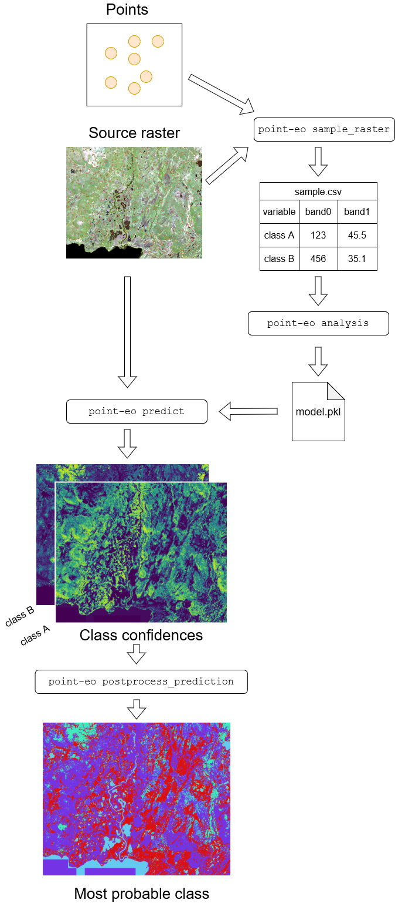

# point-eo

Python library and module for training machine learning models on point-based data and large rasters.

Features:

- Sampling features from a raster using point geometries
- Model training with sklearn and AutoML with TPOT
- Model performance metrics
- Prediction on large rasters

See the [demo](docs/demo.md) for more details on features and a guide on running point-eo on the command line.
See the [demo notebook](docs/demo_notebook.ipynb) for a demo of the Python API.

## Overview



## Installation

```cmd
git clone https://github.com/mikkoim/point-eo.git
cd point-eo
```

Install [miniconda](https://docs.conda.io/en/latest/miniconda.html) and [Mamba](https://mamba.readthedocs.io/en/latest/installation.html) first. Then create the environment:
```cmd
mamba env create -f environment.yaml
```

Activate the environment
```
conda activate point-eo
```

and install the package
```cmd
pip install -e .
```

Now `point-eo` should be available on the command line. Running

```cmd
point-eo --help
```

shows available commands. You can find documentation of each command by running the command name and `--help`, for example:

```cmd
point-eo analysis --help
```
